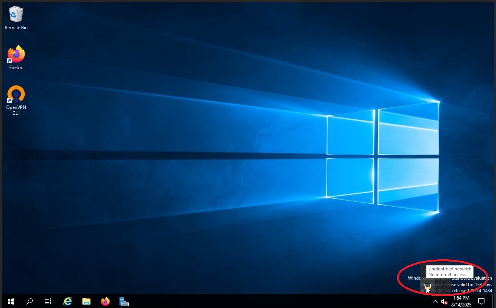
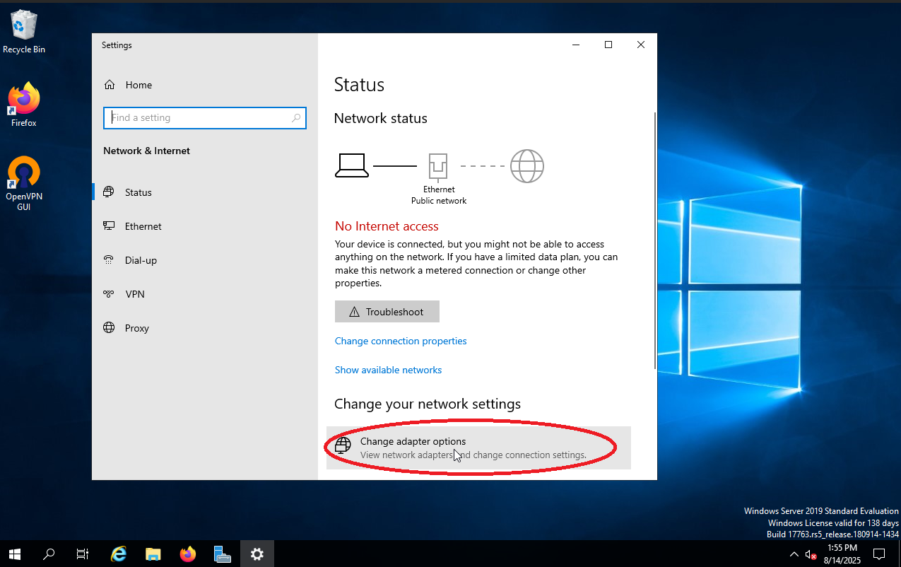
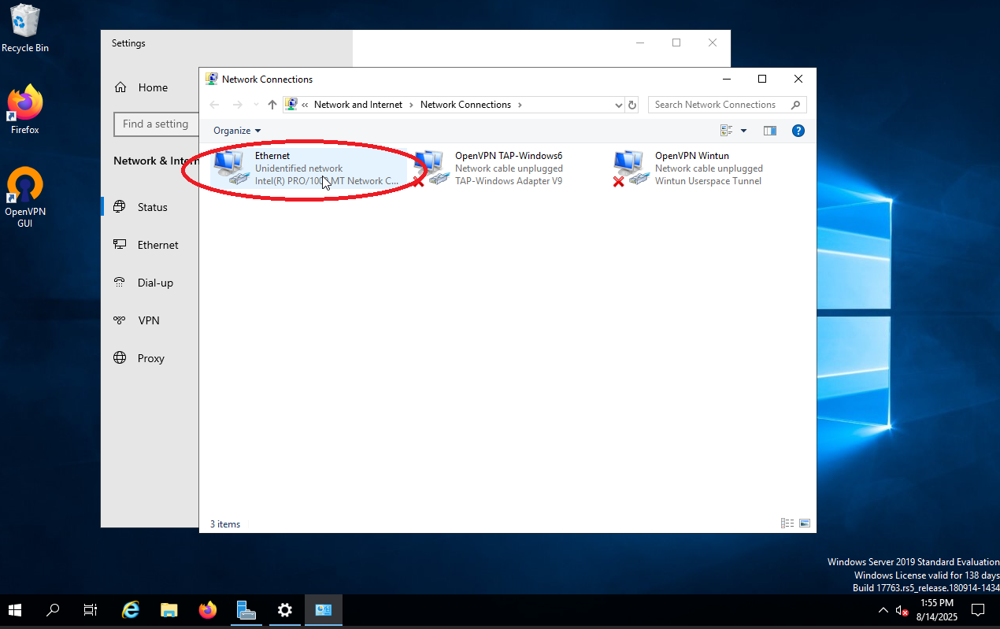
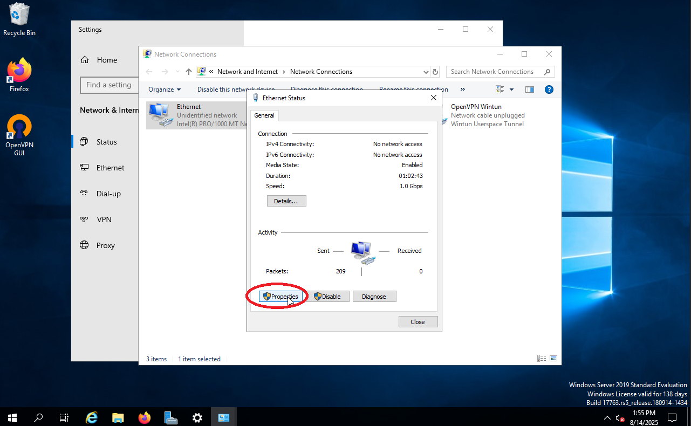
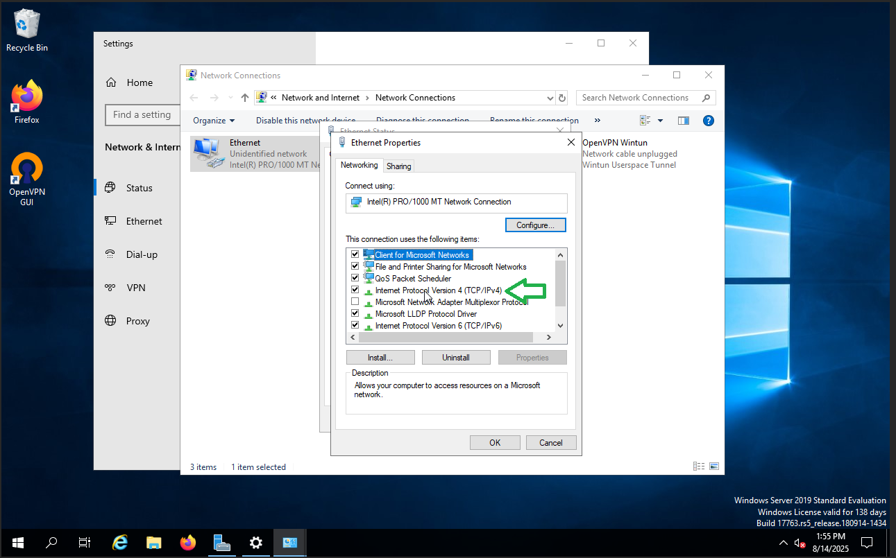
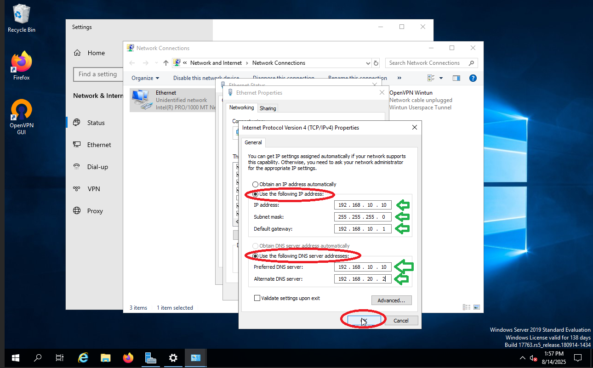
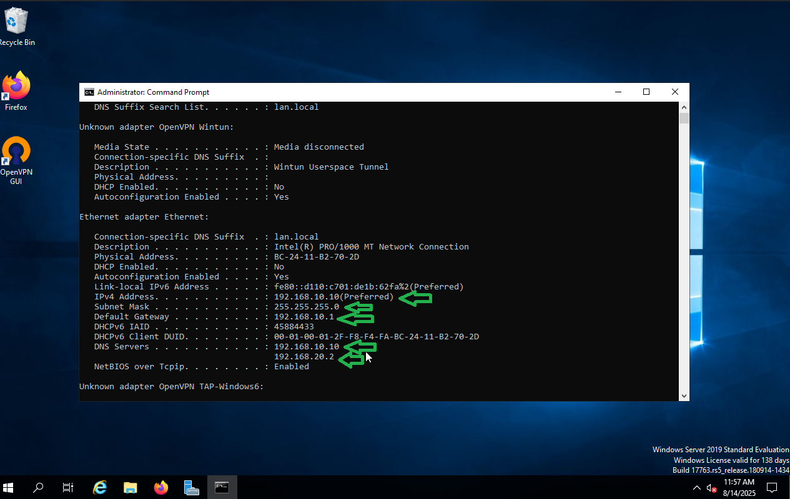

# Step 1 – Migrate DHCP from pfSense to Windows Server 2019

## 📌 Objective
Migrate DHCP services from pfSense to Windows Server 2019 for VLAN 10.  
This centralizes network services in an AD environment, allowing integrated DNS updates, better logging, and enterprise-like management.

---

## 🔹 Background
- In real-world Active Directory environments, DHCP is typically managed by Windows Server rather than a firewall/router.  
- Centralized DHCP simplifies network management, integrates with DNS, and improves client provisioning.

---

## 🛠️ Configuration Details
- **DHCP Server:** Windows Server 2019  
- **Scope Name:** VLAN10-Scope  
- **IP Range:** 192.168.10.50 – 192.168.10.200  
- **Exclusions:** 192.168.10.1 – 192.168.10.49  
- **Subnet Mask:** 255.255.255.0  
- **Default Gateway:** 192.168.10.1  
- **DNS Servers:**  
  - Primary: 192.168.10.10 (Windows Server DNS)  
  - Secondary: 192.168.20.2  

---

## 🔹 Steps Performed

### 1. **Assigned Static IP to Windows Server 2019**
  - Opened `Network & Internet Settings → Change Adapter Options → Ethernet → Properties`.
   
   
   
   

   - Selected `Internet Protocol Version 4 (TCP/IPv4)` → `Use the following IP address`.
  
   

   - Configured the following:

```bash
IP Address: 192.168.10.10
Subnet Mask: 255.255.255.0
Default Gateway: 192.168.10.1
Preferred DNS: 192.168.10.10
Alternate DNS: 192.168.20.2
```
    
  

   - Confirmed settings via

  ```cmd
  `ipconfig /all`.
  ```
  

---

2. **Disabled DHCP on pfSense VLAN 10**  
   - Navigated to `Services → DHCP Server`  
   - Disabled DHCP for VLAN 10 only  
   - Verified service stopped  

  
  
  

  
3. **Installed DHCP Role on Windows Server 2019**  
   - Server Manager → Add Roles and Features → DHCP Server  
   - Completed post-install configuration and authorized in AD  

   

---

4. **Created New DHCP Scope**  
   - Scope Name: VLAN10-Scope  
   - IP Range: 192.168.10.50–192.168.10.200  
   - Exclusions: 192.168.10.1–192.168.10.49  
   - Default Gateway: 192.168.10.1  
   - DNS Servers: 192.168.10.10, 192.168.20.2  
   - Activated scope  

   

---

5. **Tested DHCP on Clients**

   **Windows 10 Client**:  
   ```cmd
   ipconfig /release
   ipconfig /renew
   ipconfig /all
