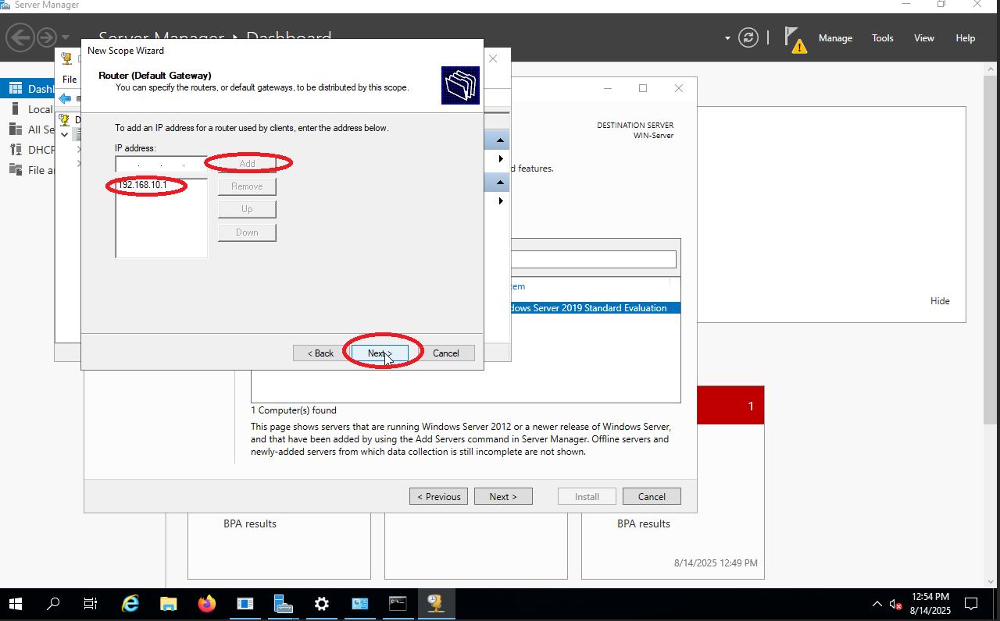

# Step 1 – Migrate DHCP from pfSense to Windows Server 2019

## 📑 Table of Contents
- [📌 Objective](#-objective)
- [🔹 Background](#-background)
- [🛠️ Configuration Overview](#️-configuration-overview)
- [🔹 Steps Performed](#-steps-performed)
  - [1. Assigned Static IP to Windows Server 2019](#1-assigned-static-ip-to-windows-server-2019)
  - [2. Disabled DHCP on pfSense VLAN 10](#2-disabled-dhcp-on-pfsense-vlan-10)
  - [3. Installed DHCP Role on Windows Server 2019](#3-installed-dhcp-role-on-windows-server-2019)
  - [4. Created New DHCP Scope](#4-created-new-dhcp-scope)
  - [5. Tested DHCP on Clients](#5-tested-dhcp-on-clients)
    - [Windows 10 Client](#windows-10-client)
    - [Windows 11 Client](#windows-11-client)
    - [Debian Client](#debian-client)
  


## 📌 Objective
Migrate DHCP services from pfSense to Windows Server 2019 for VLAN 10.  
This centralizes network services in an AD environment, enabling:
- Intergrated DNS updates
- Better logging
- Enterprise-like management

---

## 🔹 Background
- In real-world Active Directory environments, DHCP is usually managed by **Windows Server**, not firewalls/routers.  
- Benefits of centralized DHCP:
    - Simplified network management
    - Automatic DNS integration
    - Improved reliability and control

---

## 🛠️ Configuration Overview
- **DHCP Server:** Windows Server 2019  
- **Scope Name:** VLAN10-Scope  
- **IP Range:** 192.168.10.50 – 192.168.10.200  
- **Exclusions:** 192.168.10.1 – 192.168.10.49  
- **Subnet Mask:** 255.255.255.0  
- **Default Gateway:** 192.168.10.1  
- **DNS Servers:**  
  - Primary: 192.168.10.10 (Windows Server DNS)  
  - Secondary: 192.168.20.2  

---

## 🔹 Steps Performed

### 1. **Assigned Static IP to Windows Server 2019**
  - Opened `Network & Internet Settings → Change Adapter Options → Ethernet → Properties`.
   
   
   
   

   - Selected `Internet Protocol Version 4 (TCP/IPv4)` → `Use the following IP address`.
  
   

   - Configured the following:

```bash
IP Address: 192.168.10.10
Subnet Mask: 255.255.255.0
Default Gateway: 192.168.10.1
Preferred DNS: 192.168.10.10
Alternate DNS: 192.168.20.2
```
    
  

   - Confirmed settings via

  ```cmd
  `ipconfig /all`.
  ```
  

---

### 2. **Disabled DHCP on pfSense VLAN 10**  
   - Navigated to `Services → DHCP Server`  
   - Disabled DHCP for VLAN 10 only  
   - Save Configuration

  
  
  

  
### 3. **Installed DHCP Role on Windows Server 2019**  
   - Server Manager → Add Roles and Features → DHCP Server  
   - Completed post-install configuration and authorized in AD  

  
  
  
  
  
  
  
  

---

### 4. **Created New DHCP Scope**  
   - Scope Name: VLAN10-Scope  
   - IP Range: 192.168.10.50–192.168.10.200  
   - Exclusions: 192.168.10.1–192.168.10.49  
   - Default Gateway: 192.168.10.1  
   - DNS Servers: 192.168.10.10, 192.168.20.2  
   - Activated scope  

- Tools > DHCP
  
- Win-server > IPv4 > More Actions
  
- Click Next in the Wizard scope setup 
  
  
  - Scope Name: VLAN10-Scope
  - Description: VLAN10-Leases
  
- IP Range: 192.168.10.1 – 192.168.10.200
- Length: 24 , Subnet mask: 255.255.255.0
  
- Exclusions: 192.168.10.1 – 192.168.10.49
  
- Lease Duration: 8 Days
  
- Yes, Configure DHCP Options
  
- Default Gateway: 192.168.10.1
  
- DNS Servers: 192.168.10.10, 192.168.20.2
  
- Click Next 
  
- Activated scope & Finish
  
  


---

### 5. **Tested DHCP on Clients**

### **Windows 10 Client:**  
```cmd
ipconfig /release       # Release current IP
ipconfig /renew         # Request new IP from DHCP
ipconfig /all           # Verify IP, gateway, DHCP server, and DNS
```

  
  
  


### **Windows 11 Client**:  
 ```cmd
   ipconfig /release
   ipconfig /renew
   ipconfig /all
```
  
  


### **Debian Client**:
 ```cmd
  sudo dhclient -r      # Release current IP
  sudo dhclient         # Request new IP from DHCP
  ip a                  # Check assigned IP address
  ip route              # Verify default gateway
  cat /etc/resolv.conf  # Check DNS servers
```
  

