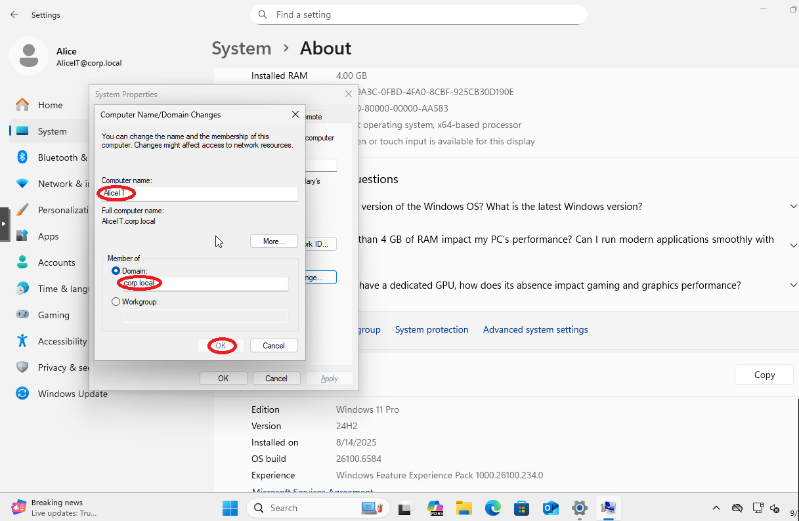

# Step 2 – Install Active Directory Domain Services (AD DS) & DNS, and Join Clients

## 📌 Objective
Install Active Directory Domain Services (AD DS) with integrated DNS on Windows Server 2019, configure a new domain, and join Windows 10, Windows 11, and Debian clients to the domain.

This step builds the foundation for:
- Centralized authentication & authorization  
- Group Policy deployment  
- Organizational Unit (OU) design & administration---

---

## 🔹 Background
- **Active Directory (AD)** centralizes authentication, authorization, and management of users, computers, and resources.
- **DNS integration** with AD enables seamless name resolution within the domain.
- Joining clients to the domain allows centralized policy enforcement, easier management, and resource deployment.
- **Organizational Units (OUs)** logically group users and devices for targeted administration.

---

## 🛠️ Configuration Details
- **Domain Name:** corp.local  
- **Domain Controller (DC):** Windows Server 2019 (DC01)  
- **Static IP (DC01):** 192.168.10.10  
- **DNS Server:** 192.168.10.10  
- **Clients:** Windows 10, Windows 11, Debian  

---

## 🔹 Steps Performed

### 1️⃣ Install AD DS on Windows Server 2019

1. Open **Server Manager** → **Manage → Add Roles and Features**.  


2. **Before You Begin** → Click **Next**.  
3. **Installation Type** → Select **Role-based or feature-based installation** → **Next**.


4. **Server Selection** → Select your server → **Next**.  


5. **Server Roles** → Check **Active Directory Domain Services**.  


6. When prompted, click **Add Features** → **Next**.  


7. Continue clicking **Next** → **Confirmation** → **Install**.  

9. Click **Install** (do not close the wizard when finished).


10. After installation, click **Promote this server to a domain controller**.


---

### 2️⃣ Promote the Server to a Domain Controller
1. **Deployment Configuration** → Select **Add a new forest**.
2. **Root Domain Name:** `corp.local`


3. **Domain Controller Options:**
   - Keep **DNS Server** checked.
   - Set a **DSRM password** (Directory Services Restore Mode).


4. **Additional Options:**
   - NetBIOS name will default to `CORP`.


5. **Paths:** Leave default locations.


6. **Review & Install:** Click **Next** until the **Prerequisites Check** completes.


7. Click **Install** → Server will reboot automatically.


---
### 3️⃣ Authorize DHCP in Active Directory
- In AD-integrated networks, **only authorized DHCP servers** can issue IP leases.  
- Without authorization, clients may fail to receive IPs.

1. Open **DHCP Management Console** (Server Manager → Tools → DHCP).  


2. Right-click your server (e.g., `WINSERVER.corp.local`) → **Authorize**.  


3. Wait until the **red arrow turns green** → DHCP is active.


---

### 4️⃣ Join Clients to the Domain

#### 🖥️ Windows 10 / 11
1. Ensure **Preferred DNS** is set to DC (`192.168.10.10`).

   -WIN11 DNS Config


   -WIN10 DNS Config


   
3. **Right-click Start → System → Advanced system settings**.

-Win11 Settings


-Win10 Settings


5. Under **Computer Name**, click **Change**.

-WIN11 Change Name


-Win10 Change Name


7. Select **Domain**, enter: `corp.local`.

-WIN11 Domain Config


-WIN10 Domain Config


9. Enter domain **Administrator** credentials.
-WIN11 Credentials

-WIN10 Credentials


11. Accept welcome prompt → Reboot.  


---

#### 🐧 Debian Client
```bash
# Set DNS server to Domain Controller
sudo nano /etc/resolv.conf
# Add:
nameserver 192.168.10.10

# Install required packages
sudo apt update && sudo apt install realmd sssd samba-common \
    samba-common-bin packagekit adcli -y

# Discover the domain
realm discover corp.local

# Join the domain
sudo realm join corp.local -U Administrator

# Verify
realm list


