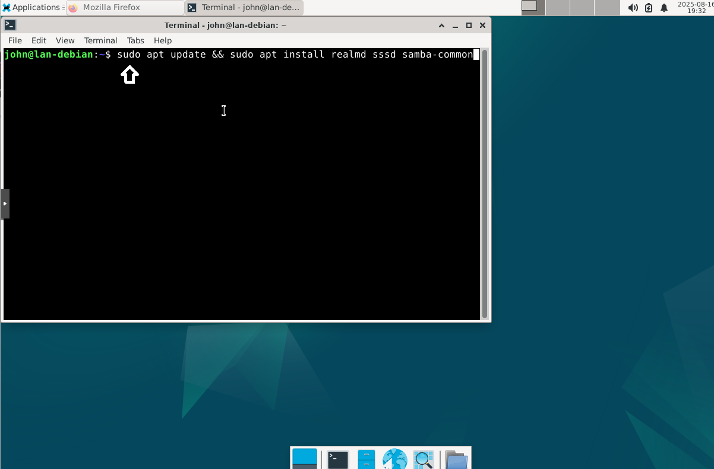
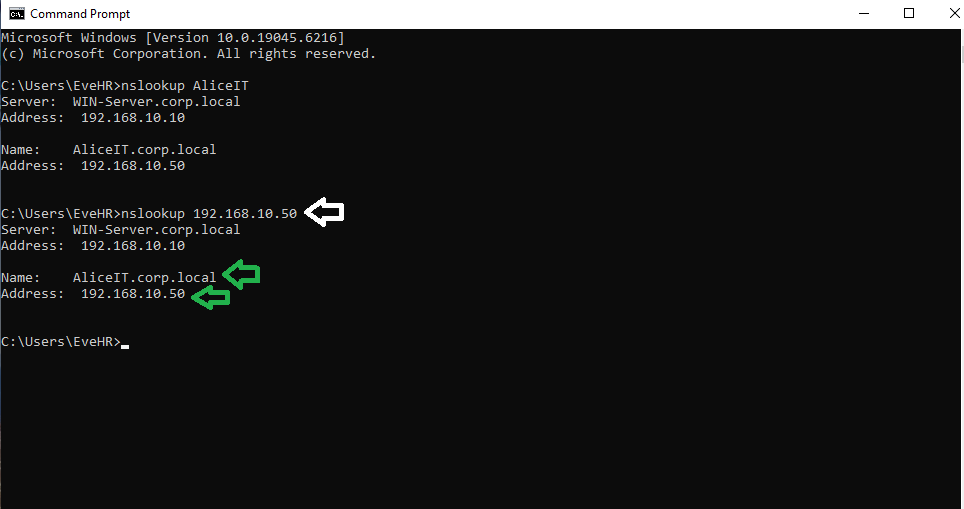

# Step 2 – Install Active Directory Domain Services (AD DS) & DNS, and Join Clients

## 📑 Table of Contents
- [📌 Objective](#-objective)
- [🔹 Background](#-background)
- [🛠️ Configuration Details](#configuration-details)
- [🔹 Steps Performed](#-steps-performed)
  - [1️⃣ Install AD DS on Windows Server 2019](#1-install-ad-ds-on-windows-server-2019)
  - [2️⃣ Promote the Server to a Domain Controller](#step-2-promote-the-server-to-a-domain-controller)
  - [3️⃣ Authorize DHCP in Active Directory](#step-3-authorize-dhcp-in-active-directory)
- [🔐 Secure Domain Controller – Post-Promotion Tasks](#secure-domain-controller--post-promotion-tasks)
  - [4️⃣ Configure DNS Forwarders](#step-4-configure-dns-forwarders)
  - [5️⃣ Rename the Default Administrator Account](#step-5-rename-the-default-administrator-account)
- [6️⃣ Join Clients to the Domain](#step-6-join-clients-to-the-domain)
  - [🖥️ Windows 10 / 11](#windows-10--11)
  - [🐧 Debian Client](#debian-client)
- [7️⃣ Verify DNS Forward & Reverse Lookup](#step-7-verify-dns-forward--reverse-lookup)
  - [🖥️ Forward Lookup Test](#forward-lookup-test)
  - [🖥️ Reverse Lookup Test (PTR Records)](#reverse-lookup-test-ptr-records)

---

## 📌 Objective
Install Active Directory Domain Services (AD DS) with integrated DNS on Windows Server 2019, configure a new domain, and join Windows 10, Windows 11, and Debian clients to the domain.

This step builds the foundation for:
- Centralized authentication & authorization  
- Group Policy deployment  
- Organizational Unit (OU) design & administration

---

## 🔹 Background
- **Active Directory (AD)** centralizes authentication, authorization, and management of users, computers, and resources.
- **DNS integration** with AD enables seamless name resolution within the domain.
- Joining clients to the domain allows centralized policy enforcement, easier management, and resource deployment.
- **Organizational Units (OUs)** logically group users and devices for targeted administration.

---

<a id="configuration-details"></a>
## 🛠️ Configuration Details
- **Domain Name:** corp.local  
- **Domain Controller (DC):** Windows Server 2019 (DC01)  
- **Static IP (DC01):** 192.168.10.10  
- **DNS Server:** 192.168.10.10  
- **Clients:** Windows 10, Windows 11, Debian  

---

<a id="steps-performed"></a>
## 🔹 Steps Performed


<a id="step-1-install-ad-ds-on-windows-server-2019"></a>
### 1️⃣ Install AD DS on Windows Server 2019

1. Open **Server Manager** → **Manage → Add Roles and Features**.  


2. **Before You Begin** → Click **Next**.  
3. **Installation Type** → Select **Role-based or feature-based installation** → **Next**.


4. **Server Selection** → Select your server → **Next**.  


5. **Server Roles** → Check **Active Directory Domain Services**.  


6. When prompted, click **Add Features** → **Next**.  


7. Continue clicking **Next** → **Confirmation** → **Install**.  

9. Click **Install** (do not close the wizard when finished).


10. After installation, click **Promote this server to a domain controller**.


---
<a id="step-2-promote-the-server-to-a-domain-controller"></a>
### 2️⃣ Promote the Server to a Domain Controller
1. **Deployment Configuration** → Select **Add a new forest**.
2. **Root Domain Name:** `corp.local`


3. **Domain Controller Options:**
   - Keep **DNS Server** checked.
   - Set a **DSRM password** (Directory Services Restore Mode).


4. **Additional Options:**
   - NetBIOS name will default to `CORP`.


5. **Paths:** Leave default locations.


6. **Review & Install:** Click **Next** until the **Prerequisites Check** completes.


7. Click **Install** → Server will reboot automatically.


---
<a id="step-3-authorize-dhcp-in-active-directory"></a>
### 3️⃣ Authorize DHCP in Active Directory
- In AD-integrated networks, **only authorized DHCP servers** can issue IP leases.  
- Without authorization, clients may fail to receive IPs.

1. Open **DHCP Management Console** (Server Manager → Tools → DHCP).  


2. Right-click your server (e.g., `WINSERVER.corp.local`) → **Authorize**.  


3. Wait until the **red arrow turns green** → DHCP is active.


---
<a id="secure-domain-controller--post-promotion-tasks"></a>
## 🔐 Secure Domain Controller – Post-Promotion Tasks

After promoting the server to a Domain Controller, I performed two critical security and networking configurations:

1. **Configured DNS Forwarders** – ensures domain clients can resolve external internet names.  
2. **Renamed the Default Administrator Account** – prevents attackers from targeting the well-known "Administrator" account.

---
<a id="step-4-configure-dns-forwarders"></a>
## 4️⃣ Configure DNS Forwarders

1. On the **Domain Controller (DC01)**, open **Server Manager** → click **Tools → DNS**.  
   

2. In the DNS Manager console, expand the server name → right-click **DC01** → select **Properties**.  
   

3. Go to the **Forwarders** tab → click **Edit**.  
   

4. Add public DNS servers (e.g., `8.8.8.8` for Google, `1.1.1.1` for Cloudflare).  
   

5. Click **OK** → ensure status shows **validated**.  
   

✅ Outcome: Domain clients can now resolve both **internal domain names** and **external internet names** reliably.  

---
<a id="step-5-rename-the-default-administrator-account"></a>
## 5️⃣ Rename the Default Administrator Account

1. Open **Active Directory Users and Computers (ADUC)** from **Server Manager → Tools**.  
   

2. Navigate to the **Users** container and Locate the built-in **Administrator** account → right-click → **Rename**.   
   

4. Rename it to a non-default, unique name (e.g., `SecAdmin01`).  
   Update:  
   - **First Name**: Sec  
   - **Last Name**: Admin01  
   - **Full Name**: SecAdmin01  
   - **User logon name (pre-Windows 2000)** will update automatically.  
   


5. Verify that login now requires the new username (`CORP\SecAdmin01`) with the **same password** as before.  

✅ Outcome: The default "Administrator" account is no longer predictable, reducing exposure to brute-force and credential-stuffing attacks.  

---
<a id="step-6-join-clients-to-the-domain"></a>
### 6️⃣ Join Clients to the Domain

<a id="windows-10--11"></a>
#### 🖥️ Windows 10 / 11
1. Ensure **Preferred DNS** is set to DC (`192.168.10.10`).

   -WIN11 DNS Config


   -WIN10 DNS Config


   
2. **Right-click Start → System → Advanced system settings**.

-Win11 Settings


-Win10 Settings


3. Under **Computer Name**, click **Change**.

-WIN11 Change Name


-Win10 Change Name


4. Select **Domain**, enter: `corp.local`.

- Join the Windows 11 client to the `corp.local` domain.  
- When configuring, enter **AliceIT** as the computer name (instead of the default `WIN11-CLIENT`) to keep Active Directory organized.
- After joining, the full computer name will appear as:  
  `AliceIT.corp.local`


- Join the Windows 10 client to the `corp.local` domain.  
- When configuring, enter **EveHR** as the computer name (instead of the default `WIN10-CLIENT`) to keep Active Directory organized.
- After joining, the full computer name will appear as:  
  `EveHR.corp.local`  


5. Enter domain **Administrator** credentials.
   
-WIN11 Credentials


-WIN10 Credentials


6. Accept welcome prompt → Reboot.

-WIN11 verified joined domain


-WIN10 verified joined domain


---
<a id="debian-client"></a>
#### 🐧 Debian Client


1. Ensure the client points to the Domain Controller (DC) for DNS resolution.
sudo nano /etc/resolv.conf
nameserver 192.168.10.10


2. Install required packages
sudo apt update && sudo apt install realmd sssd samba-common \
sudo apt install adcli packagekit samba-commmon-bin -y 




3. Update & Install all necessary packages for AD integration
sudo apt update
sudo apt install realmd -y


4. Check that the domain is reachable and discoverable:sudo realm discover corp.local


5. Use the AD Administrator account to join the domain
sudo realm join corp.local -U Administrator


6. Verify machine successfully join the domain
sudo realm list


7. Lookup Domain Controller
nslookup 192.168.10.10


8. Ping the Domain Controller
ping -c 3 192.168.10.10


---
<a id="step-7-verify-dns-forward--reverse-lookup"></a>
### 7️⃣ Verify DNS Forward & Reverse Lookup

After joining clients to the domain, it’s important to confirm DNS is working correctly.

---
<a id="forward-lookup-test"></a>
#### 🖥️ Forward Lookup Test

- On **Windows 10 / 11** clients, run:

```
nslookup AliceIT.corp.local
nslookup EveHR.corp.local
```


Expected Output: Should return the correct IP addresses for each client.

- On **Debian client**, run:
```powershell
nslookup AliceIT.corp.local
nslookup EveHR.corp.local
```


✅ Forward lookup confirms clients’ names resolve to their IP addresses.

---
<a id="reverse-lookup-test-ptr-records"></a>
#### 🖥️ Reverse Lookup Test (PTR Records)

- On **Windows 10 / 11** clients, run:

```
nslookup 192.168.10.50 (AliceIT)
nslookup 192.168.10.100 (EveHR)
```


Expected Output: Should return AliceIT.corp.local and EveHR.corp.local respectively.

- On **Debian client**, run:

```
nslookup 192.168.10.50 (AliceIT)
nslookup 192.168.10.100 (EveHR)
```


✅ Reverse lookup confirms that IP addresses correctly map back to client hostnames.
