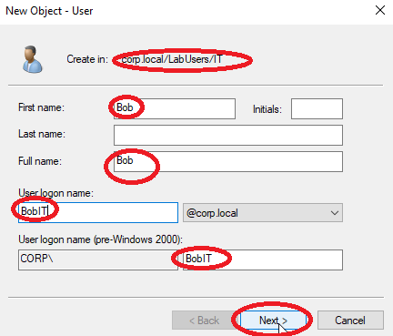

# Step 3 – Organize Active Directory, Create Users & Groups

## 📌 Objective
Organize Active Directory by creating Organizational Units (OUs), user accounts, and security groups.  
This enables structured administration, targeted Group Policy application, and role-based access management in your lab environment.

---

## 🔹 Background
- **Organizational Units (OUs):** Logical containers in AD to group users, computers, and groups.  
- **User Accounts:** Individual identities in AD for authentication and access control.  
- **Security Groups:** Collections of users for simplified permissions management.  
- **Group Policy Objects (GPOs):** Rules that can be applied to OUs to enforce policies.

---

## 🛠️ Configuration Details
- **Domain Name:** corp.local  
- **Domain Controller:** Windows Server 2019 (DC01)  
- **Static IP (DC01):** 192.168.10.10  
- **Clients:** Windows 10, Windows 11, Debian  
- **Example OU Structure:**  

---

## 🔹 Steps Performed

### 1️⃣ Create Organizational Units (OUs)
1. Open **Server Manager → Tools → Active Directory Users and Computers**.

2. Right-click your domain (`corp.local`) → **New → Organizational Unit**.

3. Enter the OU name (e.g., `LabUsers`) → **OK**

4. Repeat to create sub-OUs like 'LabUsers →`IT` & `HR`, `LabComputers → Workstations` & `Servers`. `LabGroups`.

 

5. Verify AD Users and Computers

---

### 2️⃣ Create User Accounts

1. In **Active Directory Users and Computers**, expand your domain (`corp.local`) and navigate to the **OU where you want the user** (e.g., `LabUsers → IT` or `LabUsers → HR`) We chose HR this time.

   
2. Right-click the chosen OU (HR) → **New → User**.  
   

   
3. Enter user details:  
   - **First Name:** John  
   - **Last Name:** Doe  
   - **User Logon Name (UPN):** `JdoeHR@corp.local`
   - **User Logon Name (Pre-Windows 2000):** `CORP\JdoeHR`
   - **Click Next** 

 
4. Set an **initial password**.  
   - Check **User must change password at next logon** (recommended for lab security).  
   - Optionally, uncheck if you want static passwords.

5. Review and Verify creation of John Doe user in HR

6. Repeat for multiple accounts:

   - `HR` OU → Create users like `Eve HR`, `Charlie HR`
 

   
   - `IT` OU → Create users like `Alice IT`, `Bob IT`  

  
  
    
7. Verify that the accounts appear inside their respective OUs.  

- HR List
   

- IT List
   

---

### 3️⃣ Create Security Groups & Add Users

## 📌 Objective
Create security groups for users in the IT and HR OUs and assign users to their respective groups.  
This enables centralized management of permissions, policies, and resources in Active Directory.

---

## 🔹 Steps Performed

### 1. Decide on Security Groups
For this lab, create the following groups:

- `IT_Staff` → All users in the **IT OU**  
- `HR_Staff` → All users in the **HR OU**  

---

### 2. Create Security Groups
1. Open **Server Manager → Tools → Active Directory Users and Computers (ADUC)**.  
2. Navigate to the appropriate OU (e.g., **IT OU**).  
3. Right-click → **New → Group**.
   
5. Enter **Group name:** `IT_Staff`  
6. Set **Group scope:** Global  
7. Set **Group type:** Security → **OK**
   
 
9. Repeat for HR OU → create `HR_Staff`  
   

10. Verify groups created (IT_Staff)(HR_Staff)

   
   

---

### 3. Add Users to Groups
1. Go to the **IT OU**, right-click **AliceIT** → **Add to a group…**  
   - Type `IT_Staff`, click **Check Names**, then **OK**  
2. Go to the **HR OU**, right-click **EveHR** → **Add to a group…**  
   - Type `HR_Staff`, click **Check Names**, then **OK**  

---

### 4. Verify Group Membership
1. Right-click the group (e.g., `IT_Staff`) → **Properties**  
2. Go to the **Members** tab to confirm users are listed  

---

✅ **Outcome:**  
- Users are logically grouped under **security groups**  
- Permissions and policies can now be applied at the group level instead of individually

### 4️⃣ Apply Basic Group Policy Objects (GPOs)
1. Open **Server Manager → Tools → Group Policy Management**.  
2. Right-click your OU (e.g., `Workstations`) → **Create a GPO in this domain, and Link it here**.  
3. Name the GPO (e.g., `Desktop Security Policy`).  
4. Edit GPO → Configure policies such as:
   - **Password Policies:** Minimum length, complexity, account lockout.  
   - **Desktop Restrictions:** Control Panel, drives, or software restrictions.  
   - **Scripts:** Login or logoff scripts if needed.  

---

### 5️⃣ Test Users and Groups
1. Log in from a client machine (Win 10/11 or Debian) using a domain user account.  
2. Confirm policies apply, and access permissions match the user’s group membership.  
3. Verify OU hierarchy and GPO links in **Active Directory Users and Computers** and **Group Policy Management Console**.

---

✅ **Outcome:**  
- Active Directory is structured with OUs for logical management.  
- Users and groups are created and organized.  
- GPOs applied to target OUs for policy enforcement.  
- Lab is ready for file server permissions, remote tools, and additional security configurations.
