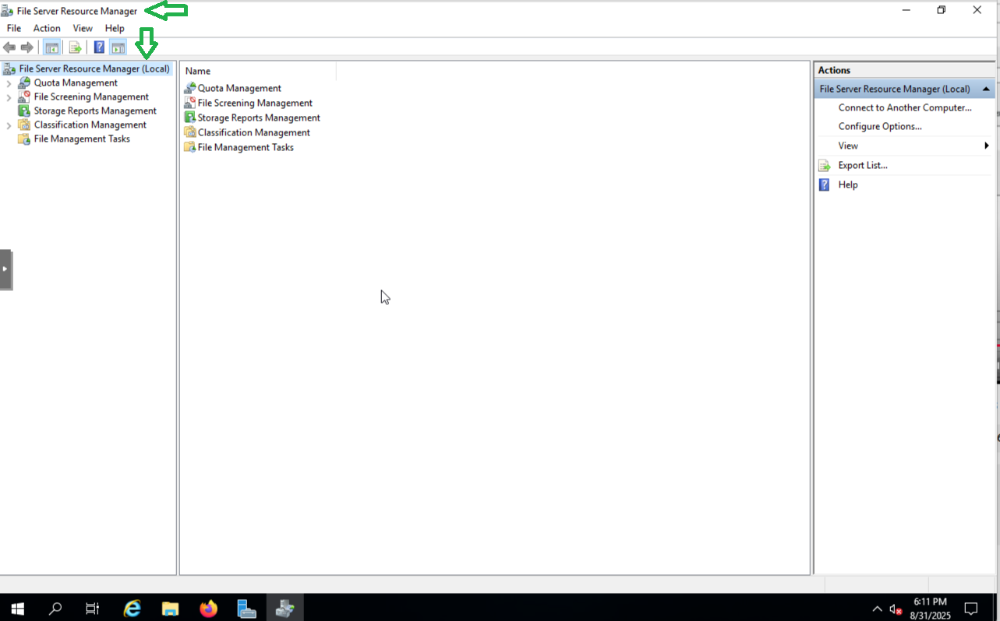

# 🗂️ Step 5: Quotas & File Screening (FSRM)

## 📑 Table of Contents

1. 🎯 [Objectives](#objectives)
2. 🛠️ [Install File Server Resource Manager (FSRM)](#1-install-file-server-resource-manager)
3. 🗄️ [Configure Quotas](#2-configure-quotas)
   - [Create Quota](#create-quota)
   - [Define Custom Properties](#define-custom-properties)
   - [Configure Notification Thresholds](#configure-notification-thresholds)
   - [Save Quota Template](#save-quota-template)
4. 🚫 [Configure File Screening](#3-configure-file-screening)
   - [Create File Screen](#create-file-screen)
   - [Define Custom File Screen Properties](#define-custom-file-screen-properties)
   - [Active Screening & Blocked File Types](#active-screening--blocked-file-types)
   - [Save File Screen Template](#save-file-screen-template)
5. ✅ [Verification](#4-verification)
   - [Test Quota](#test-the-100-mb-quota)
   - [Test File Screening](#test-the-file-screen)
   - [Verify Quota Alerts in Event Viewer](#verify-quota-alerts-in-event-viewer)

--- 
<a id="objectives"></a>
## 🎯 Objectives
In this step, we will use **File Server Resource Manager (FSRM)** to enforce storage management policies on our file server. This includes:  

- **Quotas** → Limit the amount of storage space users or folders can consume.  
- **File Screening** → Restrict the types of files users can store (e.g., block media, executables).  
- **Notifications & Reports** → Configure alerts when thresholds are reached.  


---
<a id="install-file-server-resource-manager"></a>
## 🛠️ 1. Install File Server Resource Manager

1. Open **Server Manager** → **Manage** → **Add Roles and Features**.


2. Leave **Installation Type** as *Role-based or feature-based installation* → click **Next**.  


3. Leave **Server Selection** default (local server) → click **Next**.


4. Under **Server Roles**:  
   - Expand **File and iSCSI Services**.  
   - Check **File Server Resource Manager**.  
   - When prompted, click **Add Features**.  
   - Continue clicking **Next** until the confirmation screen.

     
     
     
     
5. Click **Install** and Verify Installation.


 

---
<a id="configure-quotas"></a>
## 🗄️ 2. Configure Quotas

Quotas allow administrators to restrict the amount of data stored in a folder.  
<a id="create-quota"></a>
1. Open **File Server Resource Manager** → expand **Quota Management**.



2. Right-click **Quotas** → select **Create Quota**.  


<a id="define-custom-properties"></a>
3. In the **Quota Path**, select the target shared folder (example: `D:\Shares\HRData$`). 

4. Choose **Define custom quota properties**.  

5. Configure settings:  
   - **Hard quota** (recommended): Prevents users from exceeding the limit.  
   - Set a space limit (example: `500 MB` or `1 GB`).  
   - Add a description for documentation.


6. (Optional) Configure **Notification Thresholds**:  
   - Click **Add** → set threshold (example: `80%`).  
   - Choose actions:  
     - Send email to administrators  
     - Log an event  
     - Run a command  
     - Generate a report  


7. Create Quota, Save Template as (HRData_Quota), Verify Quota created)


---

## 3. Configure File Screening

File Screening allows administrators to block specific file types in shared folders.  

1. In **FSRM**, expand **File Screening Management**.


2. Right-click **File Screens** → select **Create File Screen**.

 
3. Select the target folder path (example: `D:\Shares\HRData$`).  
4. Choose configuration method:  
   - **Derive from a template** (preconfigured rules), or  
   - **Define custom file screen properties** (granular control).
     
5. For this lab, define a **custom file screen**:  
   - Select **Active Screening** (prevents saving disallowed files).  
   - Block categories such as:  
     - Audio and Video Files  
     - Compressed Files  
     - Executable Files  
     - Image Files  
     - Web Page Files  
   - This ensures only text/document file types are allowed in the HR share.
   
   
6. (Optional) Save this configuration as a **custom template** for reuse.


7. Click **OK** → verify the file screen is created.  


---

## 4. Verification

### Test the 100 MB Quota

On the **EveHR** (Win10 client):
Test the 100 MB Quota

On EveHR (Win10 client):

1. Open **Command Prompt**.
2. Create a 50 MB file in the mapped HR share (replace `Z:` with your mapped drive letter):

   ```bash
   fsutil file createnew Z:\test1.dat 52428800
   create another 60 MB file
   fsutil file createnew Z:\test2.dat 62914560
   ```

When you try to create the second file, it should fail because you’ve exceeded the 100 MB quota.

You should get an error like “Not enough disk space”.


- Open FSRM on the server and Verify the quota usage percentage for C:\Shares\HRData$
 


### Test the File Screen

The file screen is configured to block certain file types (e.g., `.exe`, `.mp3`).

#### Method 1: Create a Dummy EXE

1. Open **Notepad**.  
   Type `Test.exe`.  

2. Go to **File → Save As**.  
   - Change **Save as type** to **All Files**.  
   - Enter the name `test.exe`.
3. Save the file to the mapped HR share (`Z:\`).


4. Attempting to save should be **blocked** with an "Access Denied" error.


#### Verify Quota Alerts in Event Viewer

- After testing the quota by filling the HRData share, you can confirm that the quota threshold events were logged.

1. Open Event Viewer


2. In the left panel, expand:
   - Custom Views → Administrative Events


3. Look for Warning Events related to File Server Resource Manager and Click the Warning to view detailed information `(User CORP\EveHR has exceeded the 80% quota threshold 
for the quota on C:\Shares\HRData$ on server WIN-SERVER)`


---

✅ At this point, **FSRM is successfully configured** to enforce storage limits and block unwanted files in shared folders.  
