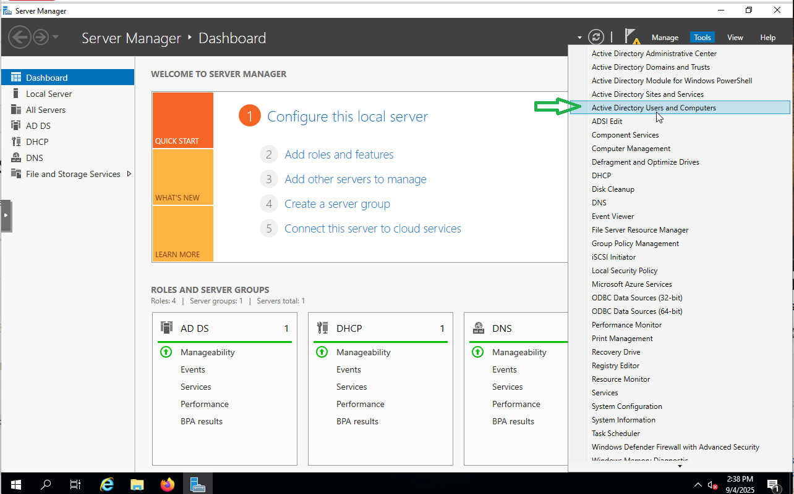
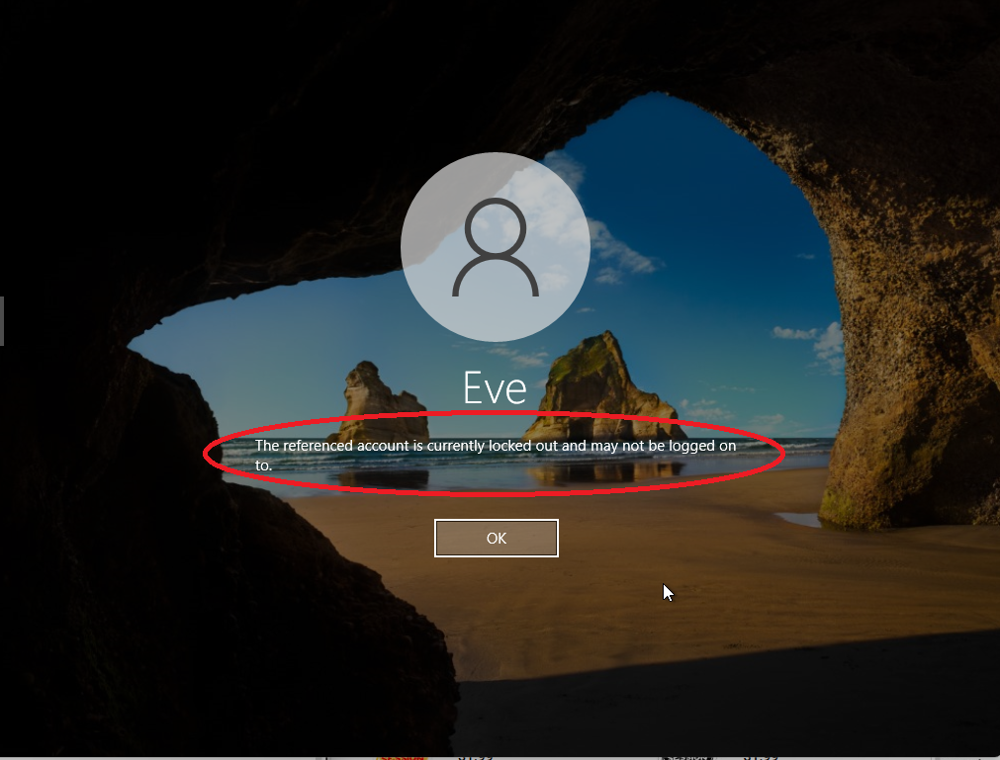

# Step 6 – Implementing Security Policies

To enforce strong password standards across the domain, I configured the **Default Domain Policy** in Group Policy Management

---

## Password Policy Configuration

### Steps
1. Open **Group Policy Management Console (GPMC)**.  
   

2. Navigate to **Group Policy Objects**, right-click **Default Domain Policy**, and select **Edit**.  
   

3. In the Group Policy Management Editor, go to:  
   `Computer Configuration → Policies → Windows Settings → Security Settings → Account Policies → Password Policy`  
   

---

### Configured Settings:
- **Enforce Password History:** 24 passwords remembered  
- **Maximum Password Age:** 60 days  
- **Minimum Password Age:** 1 day  
- **Minimum Password Length:** 12 characters  
- **Password Must Meet Complexity Requirements:** Enabled  

### Why These Settings?
- **Password History** prevents users from recycling recent passwords.  
- **Maximum Age** forces regular password changes.  
- **Minimum Age** stops users from cycling through multiple changes in one sitting.  
- **Minimum Length + Complexity** enforces stronger, harder-to-crack passwords.  

---

### Testing & Validation

- Forced a password reset for **AliceIT** in **Active Directory Users and Computers (ADUC)**  
  *(Right-click user → Reset Password → check “User must change password at next logon”).*  

- On the **WIN-11 client (AliceIT)** machine, logged in as a domain user.
   

- Attempted to set a weak password (e.g., `password1`) → **Rejected**. ✅

     
   

- Set a strong password (e.g., `P@ssw0rd!2025`) → **Accepted**. ✅
   
   

---

✅ With this configuration and testing, all Active Directory users in the **corp.local** domain are now required to follow a strong password policy aligned with enterprise best practices.

---

## Account Lockout Policy Configuration

To protect against brute-force attacks, I configured an **Account Lockout Policy** in the Default Domain Policy. This ensures that repeated invalid login attempts will temporarily lock the user’s account.

---

### Steps
1. Open **Group Policy Management Console (GPMC)**.  
   
2. Navigate to **Group Policy Objects**, right-click **Default Domain Policy**, and select **Edit**.  
   

3. In the Group Policy Management Editor, go to:  
   `Computer Configuration → Policies → Windows Settings → Security Settings → Account Policies → Account Lockout Policy`  
   

   
---

### Configured Settings (Best Practice)
- **Account Lockout Threshold:** 3 invalid logon attempts  
- **Account Lockout Duration:** 30 minutes  '
- **Allow Administrator account lockout:** Disabled
- **Reset Account Lockout Counter After:** 30 minutes
 
---

### Testing & Validation
- On the **Windows 10 client (EveHR)**, attempted to log in with the wrong password **3 times in a row**.  
- After the 3rd failed attempt → **Account locked out** ✅  
- Verified lockout message on login screen:  
  *“Your account has been locked. Please contact your administrator or try again later.”*  
- Account automatically unlocked after the configured **30 minutes**.  

---

✅ With this configuration, repeated brute-force password attempts against domain accounts are mitigated by temporary account lockouts, reducing the risk of credential-guessing attacks.
