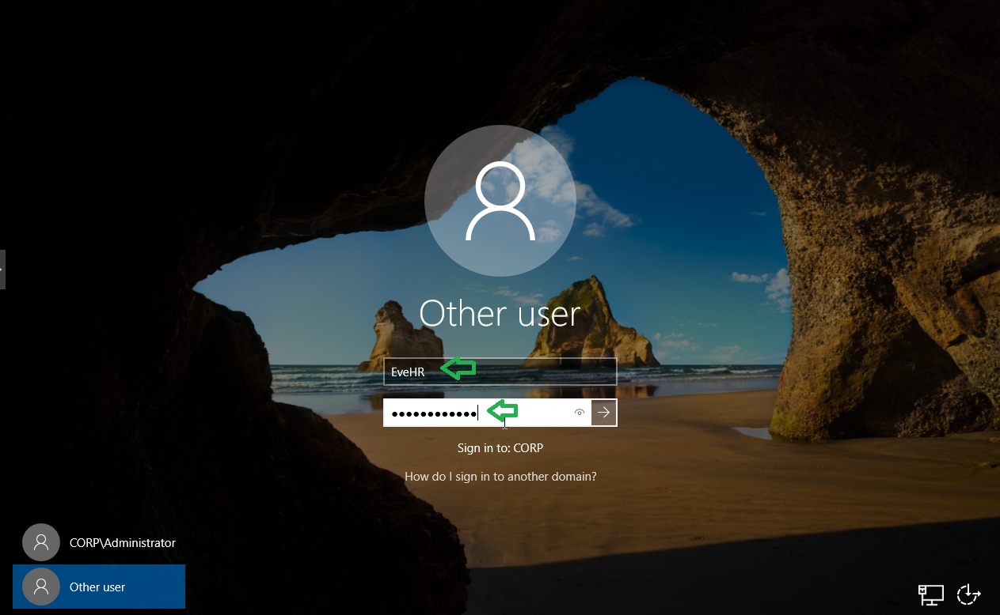
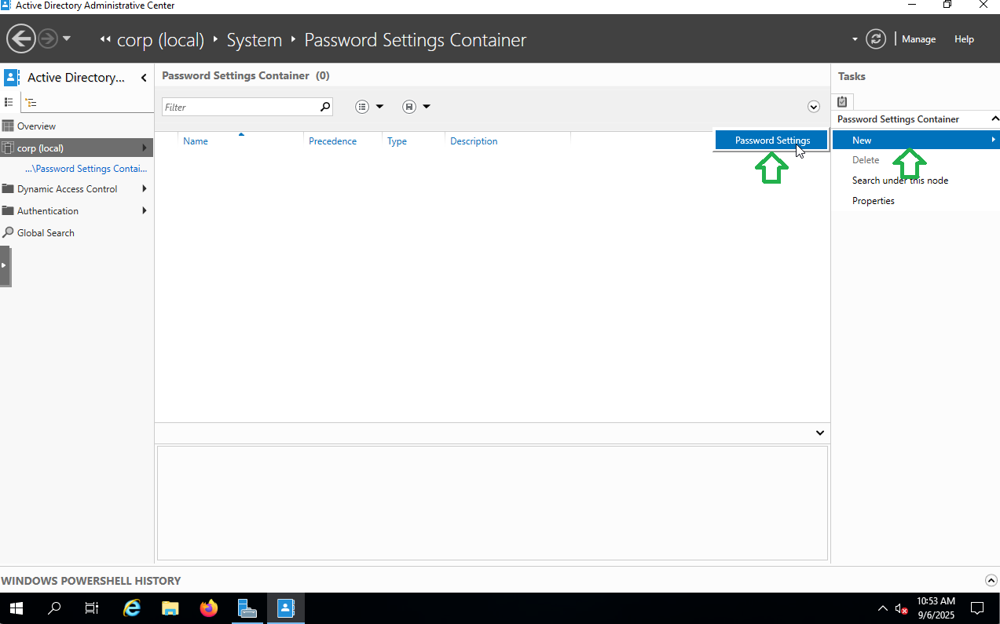

# Step 6 – Implementing Security Policies

## 📑 Table of Contents
🎯 [Objectives](#objectives)
1. 📝 [Password Policy Configuration](#password-policy-configuration)
   - [Configured Settings](#configured-settings)
   - [Testing & Validation](#testing--validation)
2. 🔒 [Account Lockout Policy Configuration](#account-lockout-policy-configuration)
   - [Configured Settings](#configured-settings-lockout)
   - [Testing & Validation](#testing--validation-lockout)
3. 👥 [User Rights Assignment Configuration](#user-rights-assignment-configuration)
   - [Configured Settings](#configured-settings-user-rights)
   - [Testing & Validation](#testing--validation-user-rights)
4. 🔐 [Implement Fine-Grained Password Policies (FGPP)](#implement-fine-grained-password-policies-fgpp)
   - [Administrative Accounts](#administrative-accounts)
   - [Standard Users](#standard-users)
   - [Verification](#verification-fgpp)

---
<a id="objectives"></a>
## 🎯 Objectives
To implement domain-wide password and account security policies using Group Policy, including strong password enforcement, account lockout thresholds, and role-based access control, thereby strengthening security posture and mitigating potential credential-based threats.

---

## Password Policy Configuration

### Steps
1. Open **Group Policy Management Console (GPMC)**.  
   

2. Navigate to **Group Policy Objects**, right-click **Default Domain Policy**, and select **Edit**.  
   

3. In the Group Policy Management Editor, go to:  
   `Computer Configuration → Policies → Windows Settings → Security Settings → Account Policies → Password Policy`  
   

---

### Configured Settings:
- **Enforce Password History:** 24 passwords remembered  
- **Maximum Password Age:** 60 days  
- **Minimum Password Age:** 1 day  
- **Minimum Password Length:** 12 characters  
- **Password Must Meet Complexity Requirements:** Enabled  


### Why These Settings?
- **Password History** prevents users from recycling recent passwords.  
- **Maximum Age** forces regular password changes.  
- **Minimum Age** stops users from cycling through multiple changes in one sitting.  
- **Minimum Length + Complexity** enforces stronger, harder-to-crack passwords.  

---

### Testing & Validation

- Forced a password reset for **AliceIT** in **Active Directory Users and Computers (ADUC)**  
  *(Right-click user → Reset Password → check “User must change password at next logon”).*  


- On the **WIN-11 client (AliceIT)** machine, logged in as a domain user.
   

- Attempted to set a weak password (e.g., `password1`) → **Rejected**. ✅

     
   

- Set a strong password (e.g., `P@ssw0rd!2025`) → **Accepted**. ✅
   
   


---

✅ With this configuration and testing, all Active Directory users in the **corp.local** domain are now required to follow a strong password policy aligned with enterprise best practices.

---
<a id="account-lockout-policy-configuration"></a>
## 🔒 Account Lockout Policy Configuration

To protect against brute-force attacks, I configured an **Account Lockout Policy** in the Default Domain Policy. This ensures that repeated invalid login attempts will temporarily lock the user’s account.

---
### Steps
1. Open **Group Policy Management Console (GPMC)**.  
   
2. Navigate to **Group Policy Objects**, right-click **Default Domain Policy**, and select **Edit**.  
   

3. In the Group Policy Management Editor, go to:  
   `Computer Configuration → Policies → Windows Settings → Security Settings → Account Policies → Account Lockout Policy`  
   

   
---
<a id="configured-settings"></a>
### Configured Settings (Best Practice)
- **Account Lockout Threshold:** 3 invalid logon attempts  
- **Account Lockout Duration:** 30 minutes  '
- **Allow Administrator account lockout:** Disabled
- **Reset Account Lockout Counter After:** 30 minutes
 
---
<a id="testing--validation"></a>
### Testing & Validation
- On the **Windows 10 client (EveHR)**, attempted to log in with the wrong password **3 times in a row**.  
- After the 3rd failed attempt → **Account locked out** ✅  
- Verified lockout message on login screen:  
  *“Your account has been locked. Please contact your administrator or try again later.”*  
- Account automatically unlocked after the configured **30 minutes**.  

---

✅ With this configuration, repeated brute-force password attempts against domain accounts are mitigated by temporary account lockouts, reducing the risk of credential-guessing attacks.

---
<a id="user-rights-assignment"></a>
## 👥 User Rights Assignment Configuration

To enforce **role-based access control (RBAC)** and enhance security, I configured **User Rights Assignment** in the **Default Domain Policy**.

---

### Steps
1. Open **Group Policy Management Console (GPMC)**.  

2. Navigate to **Group Policy Objects**, right-click **Default Domain Policy**, and select **Edit**.  

3. In the Group Policy Management Editor, go to:  
   `Computer Configuration → Policies → Windows Settings → Security Settings → Local Policies → User Rights Assignment`  

---

### Configured Settings

#### 🔒 Deny Log on Locally
- **Policy:** Deny log on locally  
- **Applied to:** `HR_Staff` group  
- **Purpose:** Prevent HR users from logging on directly to servers or domain controllers.  


#### 💻 Allow Log on Through Remote Desktop Services
- **Policy:** Allow log on through Remote Desktop Services  
- **Applied to:** `IT_Staff` group  
- **Purpose:** Restrict remote desktop access to IT administrators only.  


---

### Testing & Validation
- On the **Windows 11 client (AliceIT)**:  
  - Confirmed that an **HR_Staff** account cannot log in locally.

 
- On the **Windows 10 client (EveHR)**:  
  - Attempted RDP with `HR_Staff` → **Access Denied**.

 
 


  - Attempted RDP with `IT_Staff` → **Access Granted** ✅.  
 
 
 

---

✅ This ensures only authorized IT staff can use RDP for administrative tasks, while HR staff have restricted access, reducing the attack surface and following the principle of least privilege.

---


# 🔐 Step 6 – Implement Fine-Grained Password Policies (FGPP)

## 📌 Scenario
The organization wants stricter password rules for administrative accounts, while standard users follow less stringent requirements.  
We’ll use **Password Settings Objects (PSOs)** in **Active Directory Administrative Center (ADAC)** to apply different password policies to different groups.

---

## 🛠️ Configuration

### 1️⃣ Open ADAC
1. On the **Windows Server (Domain Controller)**, open:  
   **Server Manager → Tools → Active Directory Administrative Center (ADAC)**


3. Navigate to:  
   `corp.local → System → Password Settings Container`  


---

### 2️⃣ Create a Policy for Administrative Accounts
1. In the right-hand pane, click **New → Password Settings**.



3. Configure the following:  
   - **Name:** `AdminPasswordPolicy`  
   - **Precedence:** `1` (lowest number = highest priority)  
   - **Minimum Password Length:** `15`  
   - **Enforce Password History:** `5`  
   - **Complexity Requirements:** Enabled  
4. Under **Directly Applies To → Add**, select the **IT_Staff** group.

   

6. Click **OK** to create the policy.


✅ Outcome: All IT staff (admins) must use strong 15+ character passwords with history enforcement.

---

### 3️⃣ Create a Policy for Standard Users
1. In the same container, click **New → Password Settings** again.


3. Configure the following:  
   - **Name:** `UserPasswordPolicy`  
   - **Precedence:** `2`  
   - **Minimum Password Length:** `10`  
   - **Enforce Password History:** `5`  
   - **Complexity Requirements:** Enabled


4. Under **Directly Applies To → Add**, select the **HR_Staff** group.
6. Click **OK** to create the policy.


✅ Outcome: HR users must use at least 10-character passwords with complexity.

---

### 4️⃣ Verification
1. Run `ADAC` → check **Password Settings Container** → ensure both PSOs are listed.


2. On WIN-Server, confirm applied policies:

```powershell
Get-ADUserResultantPasswordPolicy -Identity AliceIT
Get-ADUserResultantPasswordPolicy -Identity EveHR
```


3. Test on Server (Resetting Passwords in ADUC)
- Tried resetting passwords for both users directly in Active Directory Users and Computers (ADUC).

#### EveHR (HR Staff – requires 10 chars)


- Attempted short password → ❌ Failed (did not meet requirements).


  
- Attempted strong 10+ char password → ✅ Success.


#### AliceIT (IT Staff – requires 15 chars)


- Attempted short password → ❌ Failed (did not meet requirements).


- Attempted strong 15+ char password → ✅ Success.


4. On a client machine (e.g., Windows 10/11), try resetting a password for a user in **IT_Staff** vs. **HR_Staff**.

- Windows 10, HR user (EveHR) → must set 10+ character password.  
 - First entry doesnt meet requirements, second entry will.
  
  
  
  
  


- Windows 11, IT user (AliceIT) → must set 15+ character password.


