# Step-8_Effective_Permissions_and_Inheritance

## 📌 Objective  
Demonstrate **explicit permissions, inheritance, group memberships, and deny permissions** using NTFS and file sharing.  

We will create a **Common** folder accessible to everyone, but restrict the **Project** subfolder so only members of the `Project` security group have access. The **Events** subfolder will remain fully accessible to all.  

---

## 🛠️ Steps  

### 1️⃣ Create Security Group in ADUC  
1. On **Windows Server**, open **Active Directory Users and Computers (ADUC)**.
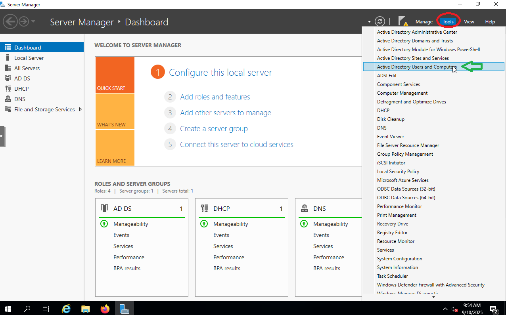
 
2. Navigate to `LabUsers` OU → **New → Group**.  
   - **Group name:** `Project`  
   - **Group scope:** Global  
   - **Group type:** Security
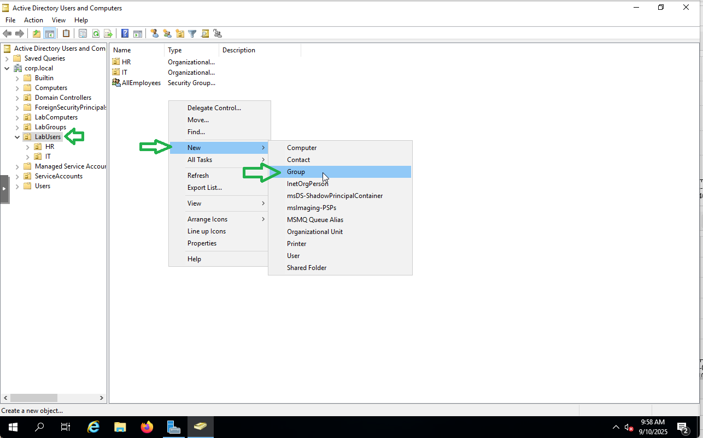
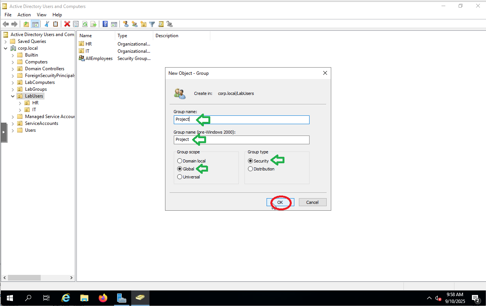
3. Add user (Alice) as member of the `Project` group.  
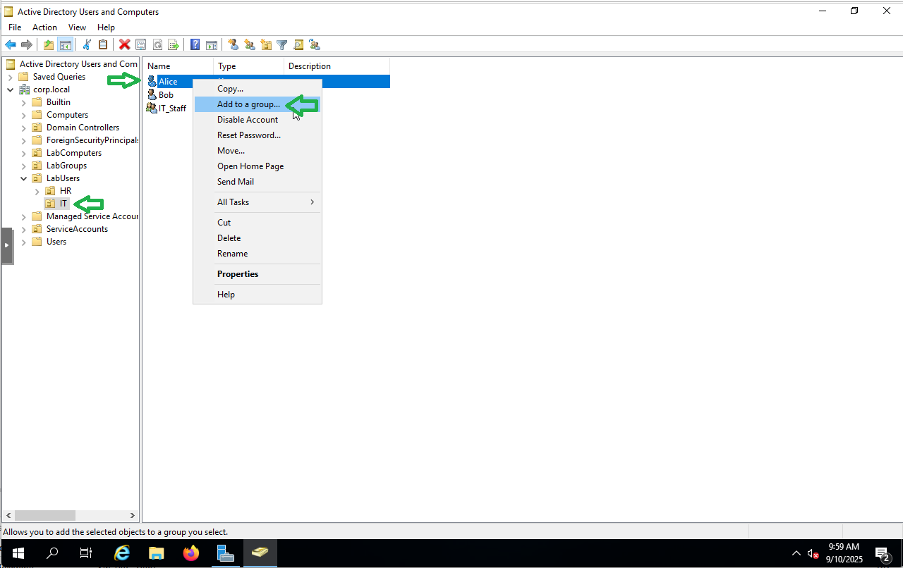
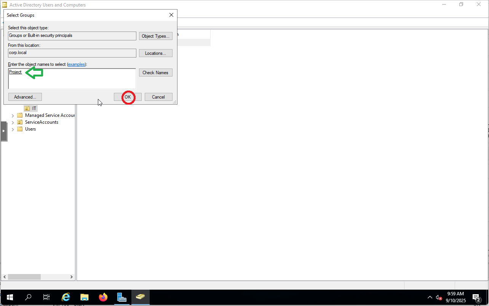
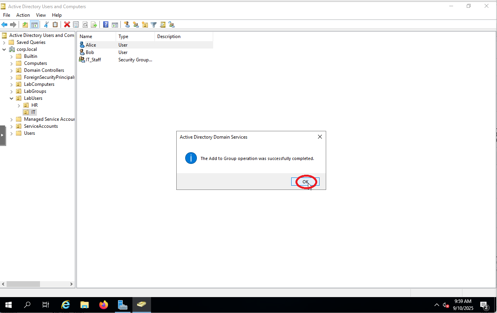

---

### 2️⃣ Create Folder Structure  
1. On the server, open **File Explorer** → `C:\`.
  
2. Create a new folder named **Common**.
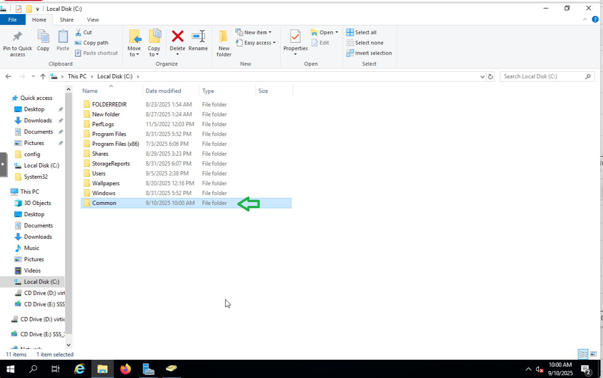
3. Inside **Common**, create two subfolders:  
   - `Project`  
   - `Events`  
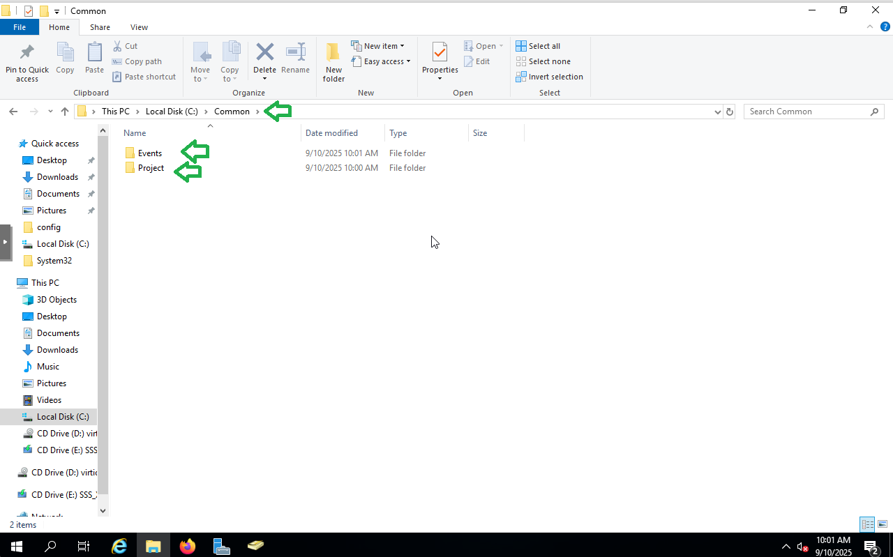
---

### 3️⃣ Configure Share Permissions  
1. Right-click **Common** → **Properties** → **Sharing** → **Share** → **Add Everyone** → **Share** → **Advanced Sharing**.
 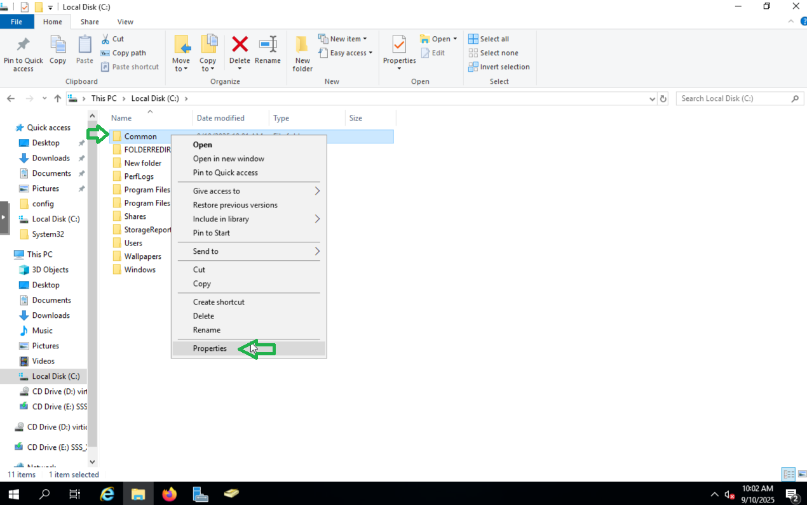
 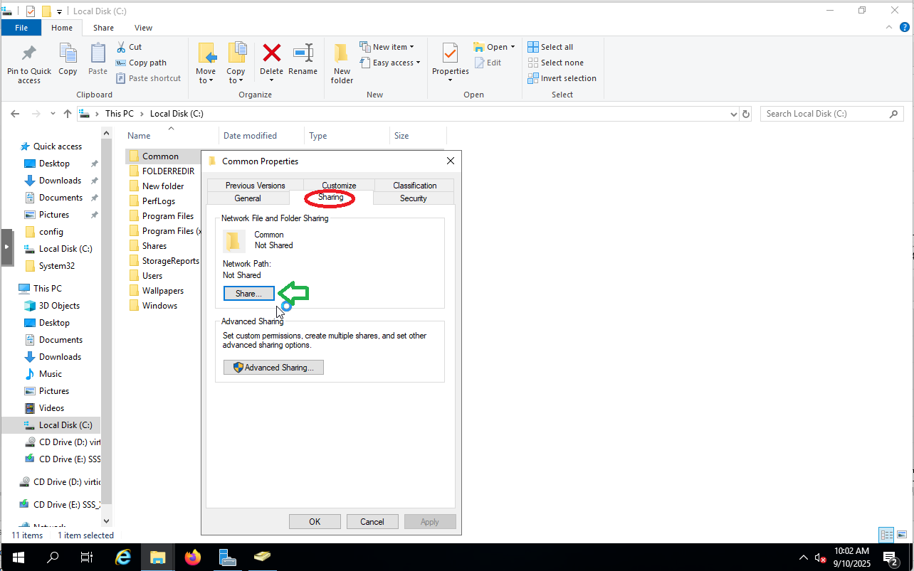
 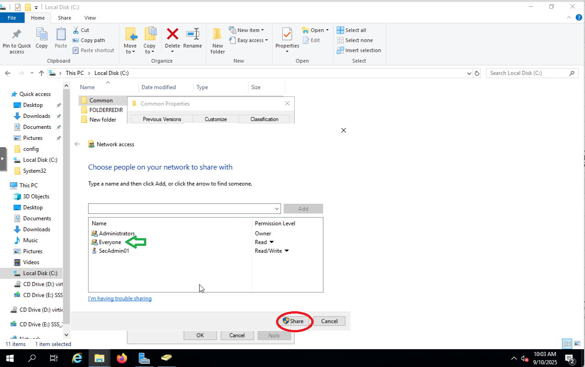
 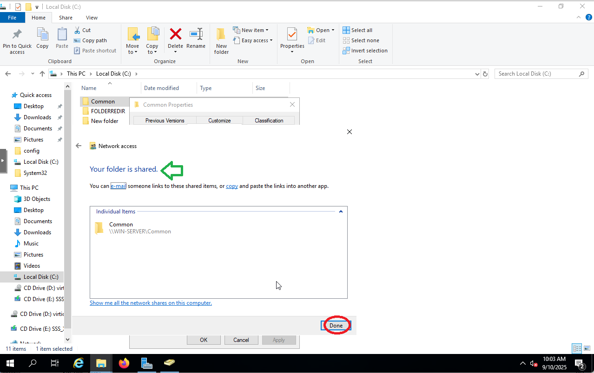

2.**Common** → **Properties** → **Sharing** → **Advanced Sharing** → **Permissions** → **Allow Full Control** → **Apply** → **Share** 
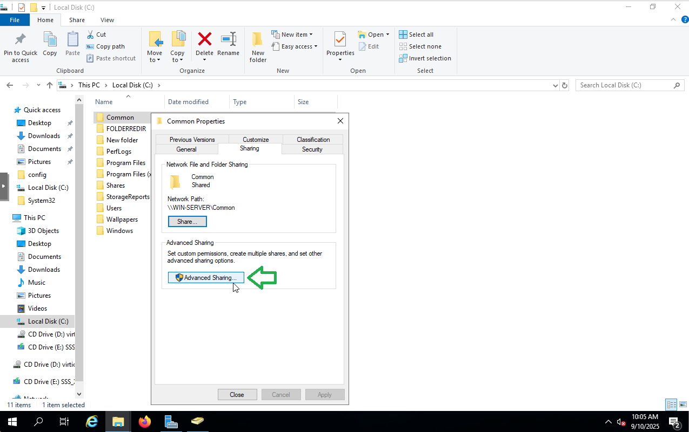
3. Check **Share this folder** → click **Permissions**. 
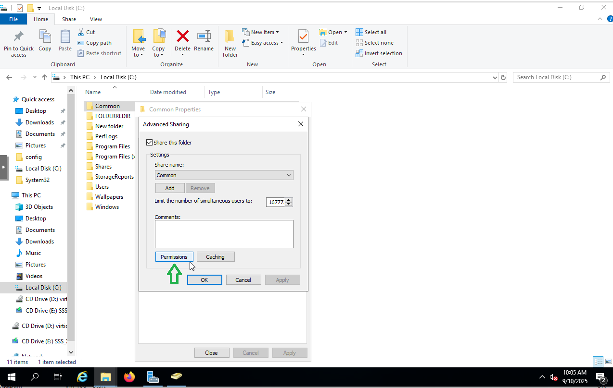
4. Add `Everyone` → assign **Full Control**.  
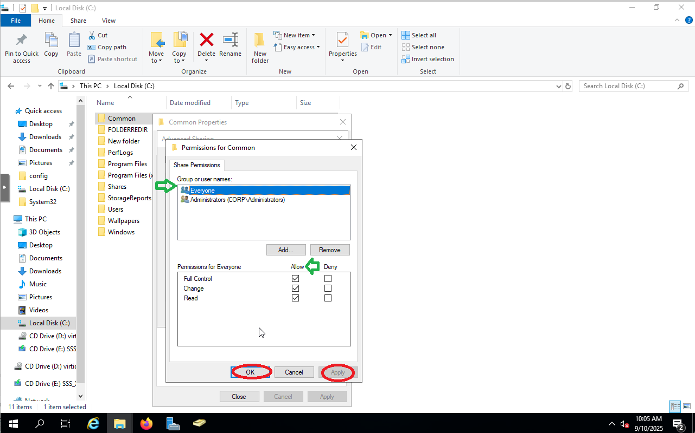

---

### 4️⃣ Configure NTFS Permissions (Inheritance)  
1. On **Common** folder → **Properties → Security** tab.

2. Edit → add `Everyone` → assign **Full Control**.  
   - This ensures permissions flow to all subfolders (`Project`, `Events`, `Contracts`).  
4. Check that **Project** and **Events** inherited the same permissions.  
5. (Optional) Inside `Project`, create another subfolder `Contracts` to verify inheritance behavior.
📸 *[Insert screenshot: NTFS permissions for Common]*  

---

### 5️⃣ Restrict the Project Subfolder  
1. Right-click `Project` → **Properties → Security → Advanced**.  
2. Click **Disable inheritance**.  
3. Choose **Convert inherited permissions into explicit permissions**.  
4. Remove `Everyone`.  
5. Add the `Project` security group → assign **Modify** (or **Full Control**).  

📸 *[Insert screenshot: Project subfolder advanced permissions]*  

---

### 6️⃣ Verify Permissions  
- **Login as a Project group member (e.g., AliceIT):**  
  - Should access `Common`, `Events`, and `Project`.  
- **Login as a non-Project user (e.g., EveHR):**  
  - Should access `Common` and `Events`.  
  - Should be denied access to `Project`.  

📸 *[Insert screenshot: Access test results]*  

---

## ✅ Results  
- `Common` → accessible by everyone.  
- `Events` → accessible by everyone (inherits from Common).  
- `Project` → restricted, only `Project` group members can access.  
- Inheritance successfully disabled and overridden for `Project`.  

# Explicit Deny Permissions in NTFS

In this step, we configure **explicit deny permissions** in NTFS to restrict access for a single user (EveHR) to a confidential folder, while allowing all other employees access.

---

## Scenario
- A **Project** folder is shared with the **AllEmployees** group.  
- The folder has two subfolders:  
  - `Confidential` → should be hidden from or inaccessible to **EveHR**.  
  - `Materials` → should remain accessible to all employees.  

EveHR is a member of the **AllEmployees** security group, but we need to block her explicitly from accessing the **Confidential** folder without impacting other users.

---

## Steps

### 1. Create Folder Structure
1. On the server, open **File Explorer**.  
2. Create the following folders on `C:\`:  
   - `Project`  
   - Inside `Project`, create:
     - `Confidential`  
     - `Materials`  

📸 *Screenshot: Folder structure in File Explorer*

---

### 2. Configure Share Permissions
1. Right-click **Project → Properties → Sharing → Advanced Sharing**.  
2. Enable **Share this folder**.  
3. Add **Everyone** with **Full Control**.  
   - (Share permissions are typically left open; NTFS handles security restrictions.)  

📸 *Screenshot: Advanced Sharing window*

---

### 3. Configure NTFS Permissions
1. Right-click the **Project** folder → **Properties → Security → Edit**.  
2. Ensure **AllEmployees** has **Read/Write (Modify)** permissions.  
3. Inherit permissions down to both subfolders.

📸 *Screenshot: Project folder permissions*

---

### 4. Apply Explicit Deny for EveHR
1. Go to **Confidential → Properties → Security → Advanced**.  
2. **Disable inheritance** → *Convert existing permissions to explicit*.  
3. Remove unnecessary inherited groups if needed (keep Admins/System).  
4. Add **EveHR**:  
   - **Allow** → *This folder only* → ✔️ List folder / read data  
   - **Deny** → *This folder only* → ❌ Read & execute, ❌ Read  

This ensures EveHR can **see** the `Confidential` folder but will get **Access Denied** when attempting to open it.

📸 *Screenshot: Advanced Security settings for Confidential*

---

### 5. Testing
- **Log in as Alice (Project member):**  
  - Can access `Project → Confidential` and `Materials`.  
- **Log in as EveHR (HR staff):**  
  - Can see `Project → Materials` normally.  
  - Can **see the `Confidential` folder**, but receives **Access Denied** when attempting to open it.

📸 *Screenshot: Access Denied message for EveHR*  

---

## Key Notes
- **Share permissions** = broad access (Everyone: Full).  
- **NTFS permissions** = precise control (used to enforce restrictions).  
- **Explicit deny** always overrides allow.  
- Allowing “List folder / read data” ensures the folder is visible, while denying read/execute prevents entry.  

---

✅ At the end of this step:  
- All employees except EveHR can access both subfolders.  
- EveHR sees the Confidential folder but cannot access it.
